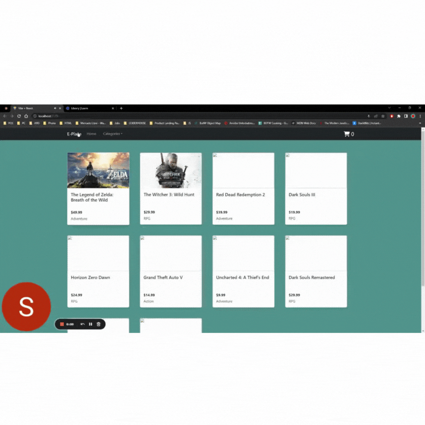

# E-Place React
# Primera Entrega React De Coderhouse
Repo para las entregas del curso!

## Descripción

E-Commerce a base de React
Navbar básico en React utilizando la librería de React Bootstrap.

## Se utilizan:
+ Props
+ Componentes
+ Librerías
+ Hooks
+ React-Router-DOM
+ Fetch API
+ Async

GIF de la Segunda Pre-Entrega:

---
**Curso:** React en Coderhouse

**Autor:** Samuel Bile  
[LinkedIn](https://www.linkedin.com/in/samuel-isaiah-bile-monta%C3%B1o-aaa43a222/)
